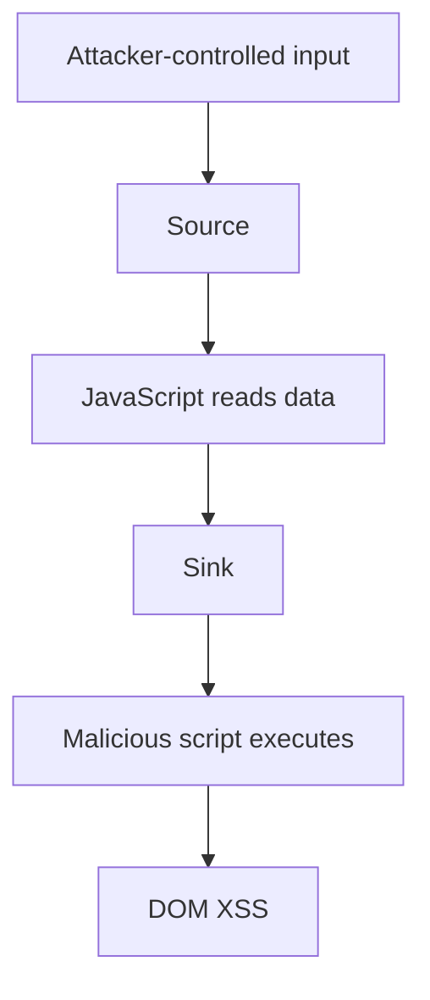

# OWASP-Cross_Site_Scipting-XSS
**OWASP Category:** A03:2025- XSS(Cross Site Scripting)
**Lab:** Kali Linux + Docker enviornment + OWASP Juice Shop + Burpsuite
**Date:**
**Status:**

-----


## 🏗️ Environment Setup

### Step 1: Install Docker

```bash
sudo apt update
sudo apt install docker.io
```

### Step 2: Install Juice Shop
'''bash
sudo docker run -d -p 3000:3000 bkimminich/juice-shop

### Step 3: Access Juice Shop 

Open the browser and go to http://localhost:3000

------
## 🔍 Understanding the vulnerability 

# XSS, Source, Sink, and DOM XSS

## What is XSS?
Cross-Site Scripting (XSS) is a web security vulnerability where an attacker injects malicious JavaScript into a website.  
The script runs in the victim’s browser and can steal data, change content, or perform actions as the user. 

## What is a Source?
A **source** is where untrusted data enters the page.  
Common sources include `location.href`, `location.search`, `location.hash`, `document.referrer`, `document.cookie`, `localStorage`, and `sessionStorage`. 

## What is a Sink?
A **sink** is a dangerous place where data is used in a way that may execute code or inject HTML.  
Common sinks include `innerHTML`, `document.write()`, `eval()`, `Function()`, and `setTimeout()` with strings. 

## What is DOM XSS?
DOM XSS happens when JavaScript reads data from a source and sends it into a sink without proper validation or escaping.  
This vulnerability happens in the browser, and the server may not be directly involved. 

## Flow Diagram



## Example
```javascript
let data = location.hash.substring(1);
document.getElementById("output").innerHTML = data;
```

If an attacker places malicious content in the URL fragment, and that value reaches `innerHTML`, the browser may execute it as script. That is a simple DOM XSS case.

## Safe Practices
- Use `textContent` instead of `innerHTML` when displaying text. 
- Validate and sanitize input before using it.
- Avoid dangerous sinks like `eval()` and `document.write()`.
- Use Content Security Policy as an extra layer of defense. 

## One-Line Summary
XSS is browser-based script injection, a source is attacker-controlled input, a sink is a dangerous output point, and DOM XSS happens when unsafe JavaScript moves data from source to sink.

  
